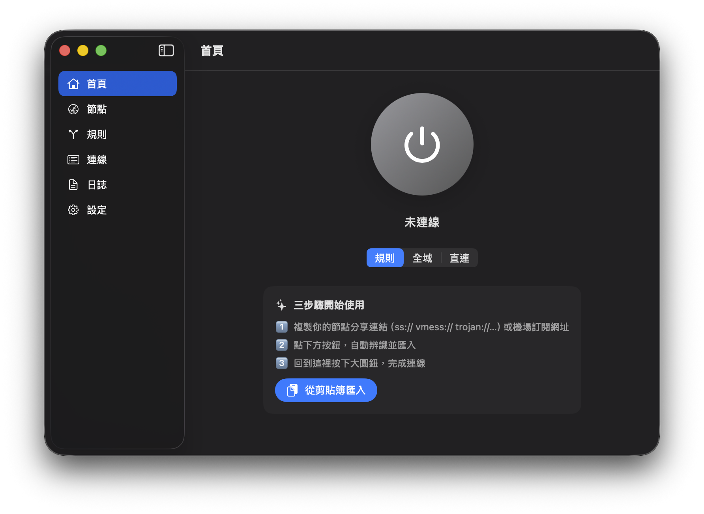

<div align="center">

# ShadowSpace

**台灣用語友善的 macOS 代理工具：選單列常駐、SwiftUI 介面、支援原生與完整引擎雙路線**


</div>

ShadowSpace 是一款 Shadowrocket 風格的 macOS 代理工具。它保留簡單的一鍵連線體驗，以 Developer ID 簽章與 Apple 公證的 DMG 對外發佈，並內建兩種可在「設定」隨時切換的代理引擎：

| 引擎 | 用途 | 技術 |
|---|---|---|
| `sing-box（完整）` | 需要完整協議、TUN、系統代理控制、GeoIP / Geosite 與 DNS 分流 | 內嵌或自動下載官方 sing-box 核心 |
| `原生` | 純 Apple 框架、不依賴外部核心，啟動輕量，具抗封鎖能力 | `ShadowCore`（SS / SS-2022 / Trojan / VLESS，含 REALITY / XTLS Vision / 自建 TLS 1.3 指紋 / UDP） |

<div align="center">

</div>

## 下載

到 **[Releases](https://github.com/voidful/shadowspace/releases)** 下載最新 `.dmg`，拖進「應用程式」即可。直發版使用 Developer ID 簽章與 Apple 公證，第一次開啟應可通過 Gatekeeper。

## 功能

### 共用體驗

- 一鍵連線：首頁大圓鈕，連線與中斷狀態清楚
- 三種模式：規則、全域、直連
- 匯入：節點分享連結、base64 訂閱、**Clash / Clash.Meta YAML 訂閱**、sing-box JSON、剪貼簿、**URL scheme（`shadowspace://`）**與**剪貼簿 QR 掃描**
- 節點管理：手動新增、編輯、複製分享連結、QR Code 匯出
- **代理群組**：手動選擇與自動測速（urltest）群組
- **節點鏈 / Relay**：先經中轉節點再落地（`detour`）
- 分流規則：網域後綴 / 關鍵字 / 完整網域、IP CIDR、GeoIP、Geosite、程序名稱，策略可選代理、直連、拒絕
- **Rule Providers**：可訂閱的遠端規則集（`.srs`）
- 訂閱管理：剩餘流量、到期日、一鍵更新、定時自動更新、可調拉取 User-Agent
- **即時流量圖**：上傳 / 下載速率折線圖與本次用量統計
- **Kill switch 防洩漏**：引擎意外停止時保留系統代理擋住流量外洩
- **自動連線 On-demand**：偵測到網路就自動連上
- **設定備份 / 匯出**與**原始 sing-box 設定檢視**
- **自動更新檢查**（GitHub Releases）
- **多語系**：繁體中文與英文介面（隨系統語言）
- 選單列常駐：快速連線、切換模式、切換節點、查看流量
- 本機資料：設定與節點存在 `~/Library/Application Support/ShadowSpace/`

### 原生引擎

- 使用純 Apple 框架（Network.framework / CryptoKit / CommonCrypto）實作的 `ShadowCore`，不依賴外部代理核心
- 支援 Shadowsocks、**Shadowsocks-2022（`2022-blake3-aes-*`）**、Trojan、VLESS、SOCKS5
- 支援 TCP、TLS、WebSocket / WSS，以及 **SOCKS5 UDP ASSOCIATE + UDP relay**（QUIC / DNS 等）
- **抗封鎖 / 抗偵測**：自建 TLS 1.3 客戶端，把 ClientHello 偽裝成瀏覽器指紋（macOS 26+ 送後量子 X25519MLKEM768），
  並原生支援 **REALITY**（抗主動探測）與 **XTLS Vision**（藏 TLS-in-TLS 特徵）
- **TLS 分片（抗封鎖）**：把 TLS ClientHello 切段送出，干擾 DPI 的 SNI 偵測
- 不支援 VMess、Hysteria2、TUIC、WireGuard、TUN、GeoIP / Geosite 與 DoH / DoT 分流（請改用 sing-box 引擎）

更多原生核心細節見 [Sources/ShadowCore/README.md](Sources/ShadowCore/README.md)。

### sing-box 完整引擎

- 支援 Shadowsocks、VMess、VLESS（含 Reality）、Trojan、Hysteria2、TUIC、**AnyTLS**、SOCKS5、WireGuard
- 支援 TUN / 增強模式，可接管終端機、Docker 等不吃系統代理的流量
- 可自動設定系統代理，也可手動指向 `127.0.0.1:7890`
- 支援 GeoIP / Geosite、程序名稱規則、**Rule Providers（可訂閱規則集）**、一鍵廣告阻擋
- 支援遠端 / 直連 DNS 分流，包含 DoH 與 DoT
- **Kill switch**：引擎意外停止時保留系統代理，避免流量直連外洩
- 第一次連線可自動下載官方 `sing-box` 核心；發佈版建議先內嵌核心

## 系統需求

- macOS 14 Sonoma 以上
- 編譯需要 Xcode 或 Command Line Tools

## 快速開始

```bash
make setup
make run
```

`make setup` 會下載 `sing-box` 核心、編譯並打包 `.app`。如果只想跑開發版：

```bash
make dev
```

第一次使用：

1. 複製你的節點分享連結或訂閱網址。
2. 開啟 ShadowSpace，點「從剪貼簿匯入」。
3. 回首頁選節點與模式，按下連線按鈕。

可在「設定」切換代理引擎：

- `原生`：預設引擎，純 Swift / Apple framework，適合 SS / SS-2022 / Trojan / VLESS（含 REALITY、XTLS Vision、自建 TLS 1.3 指紋與 UDP），強化抗封鎖能力。
- `sing-box（完整）`：完整協議與 TUN 能力，適合需要 VMess、Hysteria2、TUIC、WireGuard、TUN 或 GeoIP / Geosite 的使用者。

## 常見問題

**原生引擎和 sing-box 引擎差在哪？**  
原生引擎用純 Apple 框架實作、不依賴外部核心，除 SS / Trojan / VLESS / SOCKS5 外，還自建 TLS 1.3（偽裝瀏覽器指紋）並支援 REALITY、XTLS Vision、Shadowsocks-2022 與 UDP，具備抗主動探測 / TLS-in-TLS 偵測的抗封鎖能力；sing-box 引擎功能最完整，額外含 TUN、VMess、Hysteria2、TUIC、WireGuard 與 GeoIP / Geosite 分流。

**第一次連線很慢？**  
使用 `sing-box（完整）` 時，首次連線可能會下載核心引擎與分流規則檔；之後就會快很多。發佈版建議用 `make engine` 先內嵌核心。

**設定系統代理失敗？**  
修改網路設定需要管理員帳號。也可以關掉「連線時自動設定系統代理」，手動把 HTTP / SOCKS 代理指到 `127.0.0.1:7890`。

**和 Shadowrocket 一樣有 VPN / TUN 模式嗎？**  
`sing-box（完整）` 引擎支援 TUN / 增強模式，可接管終端機、Docker 等不吃系統代理的流量。

**訂閱匯入失敗？**  
支援 base64 節點清單、Clash / Clash.Meta YAML 與 sing-box JSON，會依內容自動判型。若仍失敗，可到「設定 → 訂閱」調整拉取 User-Agent 再試（機場常依 UA 回傳不同格式）。

## 專案結構

```text
Sources/
├── ShadowCore/                       # 純 Apple framework 原生代理核心
├── ShadowSpace/                      # App 進入點
├── ShadowSpaceKit/                   # SwiftUI UI、AppState、設定與引擎橋接
└── shadow-demo/                      # ShadowCore smoke test executable

Tests/
├── ShadowCoreTests/
└── ShadowSpaceKitTests/

scripts/
├── fetch-singbox.sh
├── sign.sh
├── make-dmg.sh
└── notarize.sh
```

## 開發

```bash
swift test
make dev
make app
make engine
```

常用命令：

- `swift test`：單元測試
- `make dev`：直接執行開發版
- `make app`：打包 `build/ShadowSpace.app`
- `make engine`：下載並內嵌 `sing-box`

## 發佈

直發版使用 **Developer ID 簽章 + Apple 公證 + DMG**。完整步驟見 [PACKAGING.md](PACKAGING.md)。

```bash
make engine
make release SIGN_IDENTITY="Developer ID Application: 你的名字 (TEAMID)"
```

完成後會產出 `build/ShadowSpace-<版本>.dmg`。不帶 `SIGN_IDENTITY` 時會使用 ad-hoc 簽章，僅適合本機測試，不能拿來對外發佈。

## 路線圖

- [x] 原生 ShadowCore 引擎
- [x] sing-box 完整引擎
- [x] TUN / 增強模式
- [x] 規則編輯器與一鍵廣告阻擋
- [x] 連線檢視器
- [x] 節點編輯、分享連結與 QR Code 匯出
- [x] DNS 自訂與訂閱自動更新
- [x] 代理群組、節點鏈 / Relay
- [x] Rule Providers（可訂閱規則集）
- [x] Clash / Clash.Meta YAML 訂閱
- [x] 即時流量圖、Kill switch、自動連線 On-demand
- [x] 設定備份 / 匯出、URL scheme、剪貼簿 QR 掃描匯入
- [x] TLS 分片（原生引擎）、AnyTLS（sing-box）
- [x] 多語系 UI（繁中 / 英文）
- [x] 自動更新檢查（GitHub Releases）
- [ ] Sparkle 靜默自動安裝（需簽章環境 / appcast）
- [ ] 全域快捷鍵

## 授權

本專案以 **[GPL-3.0](LICENSE)** 釋出。

sing-box 引擎使用 [sing-box](https://github.com/SagerNet/sing-box)（GPLv3）作為獨立、未修改的子程序；二進位檔來自官方 GitHub Releases，發佈版可內嵌於 `.app`。分流規則集來自 [sing-geosite](https://github.com/SagerNet/sing-geosite) 與 [sing-geoip](https://github.com/SagerNet/sing-geoip)。

原生引擎以 `ShadowCore`（純 Apple 框架）實作，不包含 `sing-box` 或外部核心下載。
